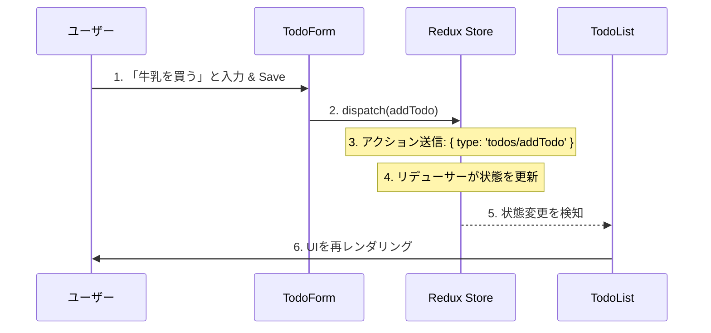

# 初心者向け Hello React Todo ガイド

このドキュメントでは、**Hello React Todo** アプリケーションの構築方法、設計、構造について解説します。
このプロジェクトで使用されているモダンな React エコシステムを理解したい初心者の方を対象としています。

## 1. 技術スタック

パフォーマンスが高く、メンテナンスしやすいアプリケーションを構築するために、モダンで業界標準の技術スタックを使用しています。

| 技術 | 役割 | 採用理由 |
| :--- | :--- | :--- |
| **React 19** | UI ライブラリ | ユーザーインターフェースを構築するためのコンポーネントベースのライブラリです。 |
| **TypeScript** | 言語 | JavaScript に静的型付けを追加し、多くの一般的なバグを防ぎます。 |
| **Vite** | ビルドツール | 非常に高速な開発サーバー兼バンドラーです。Create React App などの遅いツールに代わるものです。 |
| **Redux Toolkit** | 状態管理 | アプリケーションのグローバルな状態（Todo のリスト）を予測可能な方法で管理します。 |
| **Tailwind CSS** | スタイリング | ユーティリティファーストの CSS フレームワークです。CSS ファイルを個別に記述することなく、HTML クラスで直接スタイルを適用できます。 |
| **Yarn v4** | パッケージマネージャー | ライブラリ（依存関係）をインストールするための高速で信頼性の高いツールです。 |

## 2. ディレクトリ構成

プロジェクトは、`src/` 内で標準的な機能ベースまたはタイプベースの構造に従っています。

```
src/
├── components/      # 再利用可能な UI パーツ
│   ├── Controls.tsx    # フィルターとソートの入力
│   ├── Modal.tsx       # ポップアップダイアログのラッパー
│   ├── TodoForm.tsx    # タスクを追加/編集するフォーム
│   └── TodoList.tsx    # タスクのテーブル表示
├── store/           # Redux 状態設定
│   ├── store.ts        # メインストアの設定
│   └── todoSlice.ts    # Todo を管理するロジック（Reducers）
├── types/           # TypeScript 定義
│   └── todo.ts         # 'Todo' インターフェースの定義
├── App.tsx          # メインレイアウトとロジックの接続
└── main.tsx         # エントリーポイント（React を HTML にマウント）
```

## 3. コンポーネントの役割

すべてのコンポーネントには単一の責任があります。

*   **`App.tsx`**: 「指揮者」です。レイアウトを保持し、`Modal` の状態（開閉）を管理し、ユーザーが「追加」や「編集」をクリックしたときのフローを処理します。
*   **`TodoList.tsx`**: 「ビュー」です。Redux ストアから Todo のリストを読み込んで表示します。データを直接変更することはありません。「削除」や「完了切り替え」がクリックされたときにアクションをディスパッチ（送信）します。
*   **`TodoForm.tsx`**: 「入力」です。タスクの入力、優先度の選択、日付の選択を行うロジックを処理します。送信前に入力のバリデーション（検証）を行います。
*   **`Controls.tsx`**: 「フィルター」です。Redux のフィルター状態を更新します。検索ボックスに入力すると、このコンポーネントが動作します。

## 4. 設計思想

### 単方向データフロー (Redux)
データは一方向に移動します：
1.  **Action (アクション)**: ユーザーがボタンをクリックします。
2.  **Reducer (リデューサー)**: ストアがアクションに基づいて状態を更新します。
3.  **Selector (セレクター)**: コンポーネントが新しい状態を読み取り、再レンダリングします。

これにより、いつ・どこでデータが変更されたかが常にわかるため、デバッグが容易になります。

### ユーティリティファーストスタイリング (Tailwind)
`.btn-primary` のような CSS クラスを書く代わりに、`bg-indigo-600 px-4 py-2 text-white` のようなユーティリティクラスを書きます。これにより、スタイルをコードのすぐ隣に配置し、デザインシステムを使用した一貫性を確保できます。

## 5. 実装手順

もしゼロからこれを作成する場合、以下の手順に従います：

1.  **プロジェクトのセットアップ**:
    *   `yarn create vite` で初期化。
    *   依存関係（`redux`, `react-router`, `tailwindcss`）をインストール。
    *   `vite.config.ts` と `tailwind.css` を設定。
2.  **データモデリング**:
    *   TypeScript で `Todo` インターフェースを定義（`src/types/todo.ts`）。
3.  **状態管理**:
    *   `add`, `delete`, `toggle` などを処理する `todoSlice.ts` を作成。
    *   `store.ts` でストアを設定。
4.  **UI 実装**:
    *   データを表示する `TodoList` を作成。
    *   入力を受け取る `TodoForm` を作成。
    *   ビューをフィルタリングする `Controls` を作成。
5.  **統合**:
    *   `App.tsx` ですべてを結合。
    *   より良いユーザー体験のためにモーダルのロジックを実装。
6.  **ブラッシュアップ**:
    *   LocalStorage への保存を追加（リフレッシュ後もデータが残るように）。
    *   モバイル画面向けの調整（レスポンシブデザイン）。
7.  **デプロイ**:
    *   GitHub Pages 用に設定してデプロイ。

## 6. Redux データフロー（図解）

Redux でデータがどのように動くかを理解するのは難しいかもしれません。ここでは「Todo の追加」を例にした簡略化されたフローを示します：



1.  **ユーザー操作**: ユーザーが「牛乳を買う」と入力し、**Save** をクリックします。
2.  **ディスパッチ**: `TodoForm` が `dispatch(addTodo({ text: "牛乳を買う" }))` を呼び出します。
3.  **アクション**: アクションオブジェクト `{ type: 'todos/addTodo', payload: { ... } }` がストアに送信されます。
4.  **リデューサー**: `todoSlice` のリデューサーがこのアクションを受け取ります。*古い状態*（5個の Todo リスト）を受け取り、新しいものを追加して、*新しい状態*（6個の Todo リスト）を返します。
5.  **状態更新**: ストアが内部の状態を更新します。
6.  **再レンダリング**: `TodoList` は `useSelector(state => state.todos)` に依存しています。状態が変更されたことに気づき、新しい「牛乳を買う」の行を表示するために再レンダリングします。

## 7. カスタマイズガイド

このアプリを自分仕様にしてみませんか？以下のチャレンジを試してみてください：

### チャレンジ A: 「Critical（緊急）」優先度の追加
1.  `src/types/todo.ts` を開き、`Priority` 型に `'critical'` を追加します。
    ```typescript
    export type Priority = 'low' | 'medium' | 'high' | 'critical';
    ```
2.  `src/components/TodoForm.tsx` を開き、「Critical」用の `<option>` を追加します。
3.  `src/components/TodoList.tsx` を開き、`getPriorityColor` に `'critical'` のケースを追加します（紫や黒などにしてみましょう）。

### チャレンジ B: テーマの変更
1.  `tailwind.config.js` を開きます（またはデフォルトの色を使用します）。
2.  ヘッダーの色を変えるには、`src/App.tsx` を開き、`bg-indigo-600` を `bg-rose-600` に変更します。
3.  新しいテーマに合わせて、`TodoList.tsx`, `TodoForm.tsx`, `Controls.tsx` 内の他の `indigo` の参照（フォーカスリングなど）も変更する必要があります。

## 8. トラブルシューティング

### "Command not found: yarn"
*   **原因**: Yarn v4 がインストールされていないか、Corepack が有効になっていない可能性があります。
*   **解決策**: ターミナルで `corepack enable` を実行してください。失敗する場合は、Node.js v18 以降をインストールしてみてください。

### "Port 5173 is already in use"
*   **原因**: 別のターミナルでアプリを実行している可能性があります。
*   **解決策**: Vite は自動的に次のポート（例: 5174）を選択します。新しいリンクについてターミナルの出力を確認してください。

### "Changes are not saving to LocalStorage" (LocalStorage に保存されない)
*   **原因**: 保存ロジックはリデューサー内で自動的に処理されますが、ブラウザのキャッシュを手動でクリアするとデータは失われます。
*   **解決策**: `src/store/todoSlice.ts` を確認し、すべてのリデューサーケースで `localStorage.setItem` が呼び出されていることを確認してください。
