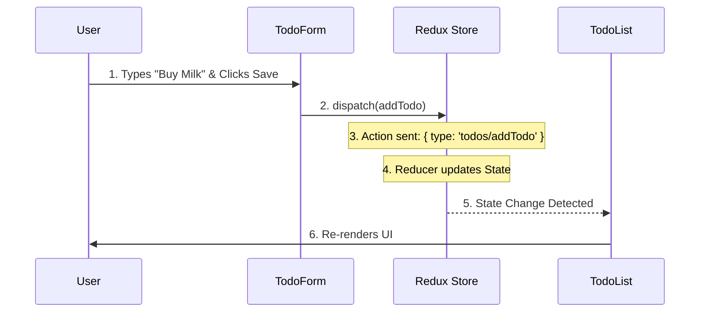

# Beginner's Guide to Hello React Todo

This document explains how the **Hello React Todo** application is built, designed, and structured. It is intended for beginners who want to understand the modern React ecosystem used in this project.

## 1. Technology Stack

We use a modern, industry-standard stack to build a performant and maintainable application.

| Technology | Role | Why we use it |
| :--- | :--- | :--- |
| **React 19** | UI Library | Component-based architecture mostly used for building user interfaces. |
| **TypeScript** | Language | Adds static typing to JavaScript, preventing many common bugs. |
| **Vite** | Build Tool | Extremely fast development server and bundler. Replaces slower tools like Create React App. |
| **Redux Toolkit** | State Management | Manages global application state (the list of todos) in a predictable way. |
| **Tailwind CSS** | Styling | Utility-first CSS framework. Allows styling directly in HTML classes without writing separate CSS files. |
| **Yarn v4** | Package Manager | Fast and reliable tool for installing libraries (dependencies). |

## 2. Directory Structure

The project follows a standard feature-based or type-based structure within `src/`.

```
src/
├── components/      # Reusable UI parts
│   ├── Controls.tsx    # Filter and Sort inputs
│   ├── Modal.tsx       # Pop-up dialog wrapper
│   ├── TodoForm.tsx    # Form to add/edit tasks
│   └── TodoList.tsx    # Table view of tasks
├── store/           # Redux State configuration
│   ├── store.ts        # The main store setup
│   └── todoSlice.ts    # Logic for managing todos (reducers)
├── types/           # TypeScript definitions
│   └── todo.ts         # 'Todo' interface definition
├── App.tsx          # Main layout and logic wiring
└── main.tsx         # Entry point (mounts React to HTML)
```

## 3. Component Roles

Every component has a single responsibility:

*   **`App.tsx`**: The "Conductor". It holds the layout, manages the `Modal` state (open/closed), and handles the flow when a user clicks "Add" or "Edit".
*   **`TodoList.tsx`**: The "View". It reads the list of todos from the Redux store and displays them. It doesn't modify data directly; it dispatches actions when "Delete" or "Toggle" is clicked.
*   **`TodoForm.tsx`**: The "Input". Handles the logic for typing a task, selecting priority, and picking a date. It validates input before submitting.
*   **`Controls.tsx`**: The "Filter". Updates the filter state in Redux. When you type in the search box, this component runs.

## 4. Design Philosophy

### Unidirectional Data Flow (Redux)
Data moves in one direction:
1.  **Action**: User clicks a button.
2.  **Reducer**: The Store updates the state based on the action.
3.  **Selector**: Components read the new state and re-render.

This makes debugging easier because you always know *where* data changed.

### Utility-First Styling (Tailwind)
Instead of writing CSS classes like `.btn-primary`, we write utility classes like `bg-indigo-600 px-4 py-2 text-white`. This keeps styles right next to the code and ensures consistency using a design system.

## 5. Implementation Steps

If you were building this from scratch, here is the sequence we followed:

1.  **Project Setup**:
    *   Initialize with `yarn create vite`.
    *   Install dependencies (`redux`, `react-router`, `tailwindcss`).
    *   Configure `vite.config.ts` and `tailwind.css`.
2.  **Data Modeling**:
    *   Define the `Todo` interface in TypeScript (`src/types/todo.ts`).
3.  **State Management**:
    *   Create `todoSlice.ts` to handle `add`, `delete`, `toggle`, etc.
    *   Configure the store in `store.ts`.
4.  **UI Implementation**:
    *   Build `TodoList` to display data.
    *   Build `TodoForm` to capture input.
    *   Build `Controls` to filter views.
5.  **Integration**:
    *   Combine everything in `App.tsx`.
    *   Implement the Modal logic for a better user experience.
6.  **Refinement**:
    *   Add LocalStorage persistence (so data stays after refresh).
    *   Adjust for mobile screens (Responsive Design).
7.  **Deployment**:
    *   Configure for GitHub Pages and deploy.

## 6. Redux Data Flow (Visualized)

Understanding how data moves in Redux can be tricky. Here is a simplified flow for "Adding a Todo":



1.  **User Event**: User types "Buy Milk" and clicks **Save**.
2.  **Dispatch**: `TodoForm` calls `dispatch(addTodo({ text: "Buy Milk" }))`.
3.  **Action**: An action object `{ type: 'todos/addTodo', payload: { ... } }` is sent to the Store.
4.  **Reducer**: The `todoSlice` reducer hears this action. It takes the *old state* (list of 5 todos), adds the new one, and returns the *new state* (list of 6 todos).
5.  **State Update**: The Store updates its internal state.
6.  **Re-render**: `TodoList` relies on `useSelector(state => state.todos)`. It notices the state changed and re-renders to show the new "Buy Milk" row.

## 7. Customization Guide

Want to make this app your own? Try these challenges:

### Challenge A: Add a "Critical" Priority
1.  Open `src/types/todo.ts` and add `'critical'` to the `Priority` type.
    ```typescript
    export type Priority = 'low' | 'medium' | 'high' | 'critical';
    ```
2.  Open `src/components/TodoForm.tsx` and add an `<option>` for "Critical".
3.  Open `src/components/TodoList.tsx` and add a case for "critical" in `getPriorityColor` (maybe make it purple or black).

### Challenge B: Change the Theme
1.  Open `tailwind.config.js` (or just rely on default colors).
2.  To change the header color, open `src/App.tsx` and change `bg-indigo-600` to `bg-rose-600`.
3.  You will need to checking `TodoList.tsx`, `TodoForm.tsx`, and `Controls.tsx` to replace other `indigo` references (like focus rings) to match your new theme.

## 8. Troubleshooting

### "Command not found: yarn"
*   **Reason**: You might not have Yarn v4 installed or Corepack enabled.
*   **Fix**: Run `corepack enable` in your terminal. If that fails, try installing Node.js v18+.

### "Port 5173 is already in use"
*   **Reason**: You might have another terminal running the app.
*   **Fix**: Vite will automatically pick the next port (e.g., 5174). Just check the terminal output for the new link.

### "Changes are not saving to LocalStorage"
*   **Reason**: The logic handles saving automatically in the reducer, but if you manually clear your browser cache, data will be lost.
*   **Fix**: Check `src/store/todoSlice.ts` to ensure `localStorage.setItem` is being called in every reducer case.

